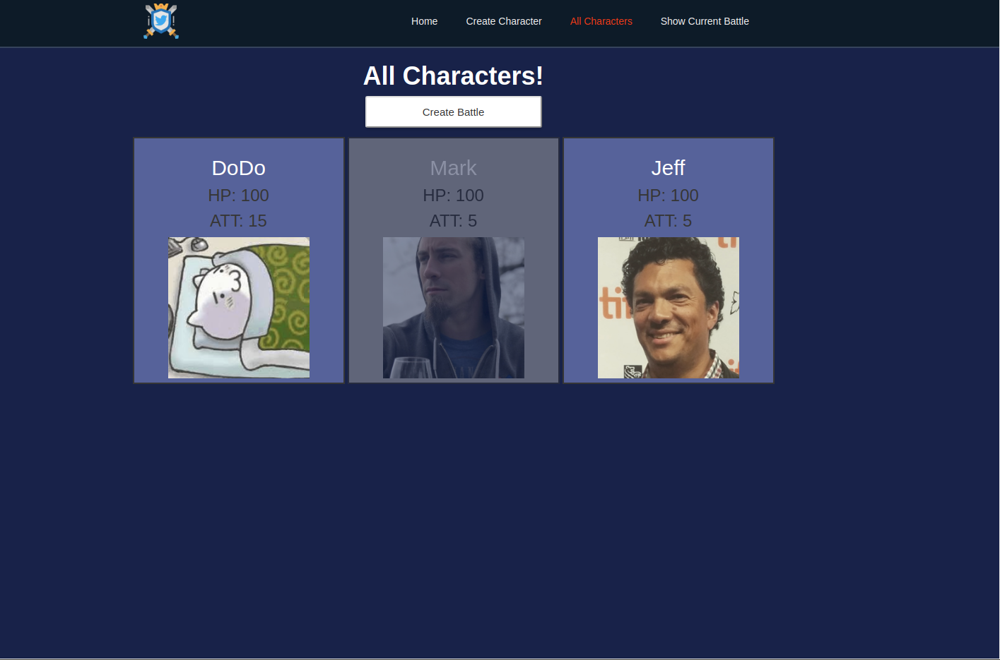
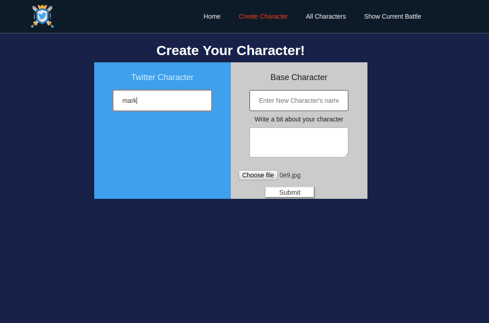
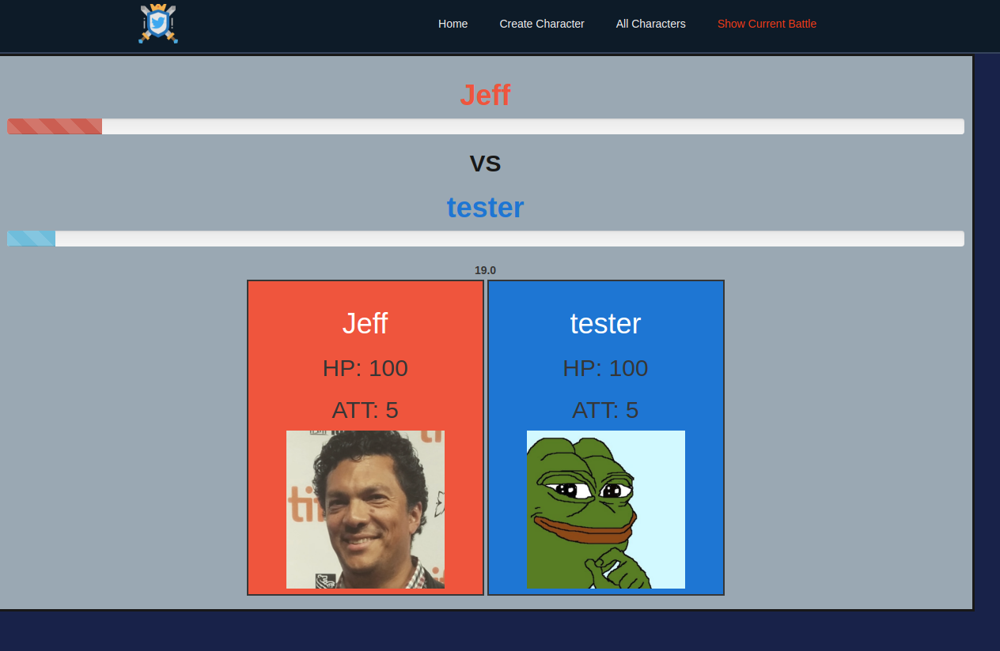

# twit-battle
my twit-battle project made with my teamate for school. this project allows user to retrieve two characters from either twitter api or uploading their own.  then they gain att/hp based on the twitter account's followers or their number of tweets. after each battle the loser gets eliminated and the winner would gain the loser's stats.

## Usage
Install the dependencies and start the server.
 
git clone git@github.com:alvintian/twit-battle.git
 
cd twit-battle
 
npm install 
 
knex migrate:latest
 
npm start
 
screenshot:
 

## Dependencies
multer
knex
react-router-dom
twitter (api)
get-twitter-bearer-token
